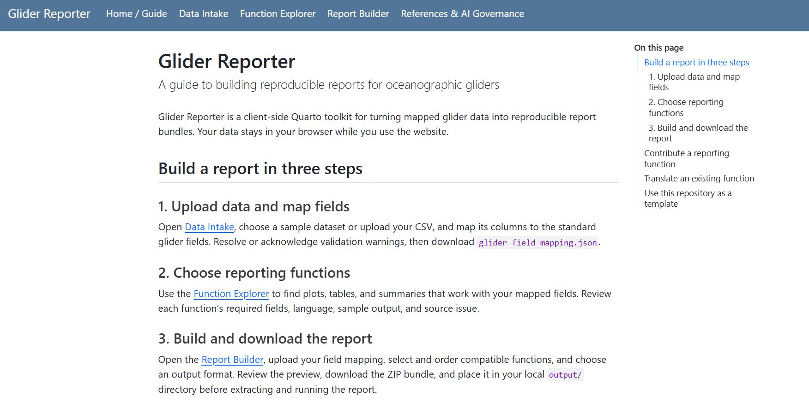

# Glider-Reporter:

## A Flexible Template for Building Markdown Reports for UW Oceanographic Gliders

## Collaborators

**Shannon Rankin:** Southwest Fisheries Science Center [Project & Process Ideation]

**AI Agents:** Gemini [create prompts for copilot]; Github CoPilot [prompts–\> process]

Prelim Functions: [cite those created during rodeo]

**Crowdsourced:**TBD-- Anyone who adds a function is a collaborator (includes citation natively)

## Dashboard & Repository

[glider-reporter site & dashboards](https://shannonrankin.github.io/glider-reporter/); [Github Repo](https://github.com/shannonrankin/glider-reporter/tree/main)

## Background

## Goals

## Methods

1.  Process/System Ideation (Shannon, wee early hours of September 16!)
2.  Create blank [glider-reporter repository](https://github.com/shannonrankin/glider-reporter) with starter .github/copilot-instructions.rmd
3.  Create Prompts (Shannon's works with Gemini to turn her mad braindump into a series of Prompts to turn into issues to work with Github CoPilot:
4.  Github Copilot via Issues (run in browser):
    1.  [Issue#1 Setup Base Repo Structure & Standards](https://github.com/shannonrankin/glider-reporter/issues/1) (CoPilot ChatGPT Luna 5.6, 4 credits)
    2.  [Issue#3 Function Issue Form Template, Registry Generator & Sample Reporting Function](https://github.com/shannonrankin/glider-reporter/issues/3) (Chat GPT Sol 5.6, 49 credits w/ additional issues to address errors)
    3.  [Issue#7 Data Intake & Interactive Field Matching Engine (Quarto + ObservableJS)](https://github.com/shannonrankin/glider-reporter/issues/7) (Chat GPT Sol 5.6, 159 credits)
    4.  [Issue#9 Interactive Function Explorer Dashboard (Quarto + ObservableJS)](https://github.com/shannonrankin/glider-reporter/issues/9) (Chat GPT Sol 5.6, 83 credits)
    5.  Issue#11 [Interactive Report Builder Dashboard & Client-Side Bundle Exporter (Quarto + ObservableJS)](https://github.com/shannonrankin/glider-reporter/issues/11https://github.com/shannonrankin/glider-reporter/issues/11) (Chat GPT Sol 5.6, 111 credits)
    6.  Issue#13 [Website Navigation, Documentation Interface & Citation/AI Reference Page](https://github.com/shannonrankin/glider-reporter/issues/13) (Chat GPT Sol 5.6, 61 credits)
5.  Review site, update \_quarto.yml, build github pages, etc.

### Datasets

Optional: standardized datasets [Glider 1.0] or User Dataset

- If user dataset, they will match fields to standardized datasets (as needed)

### Workflow

**Github Repository:** glider-reporter (<https://github.com/shannonrankin/glider-reporter>)

## Lessons Learned

## Presentation

## References

## Acknowledgements

This project was part of a [Glider Rodeo Hackathon] which worked with (or was inspired by) PAM-Glider data collected by the NOAA Fisheries Glider Rodeo (2026). This weeklong event was hosted by NOAA Fisheries with support by Openscapes (JupyterHub, Support), Oregon State University (Zoom, Box data storage), Aquaview (technical support).
