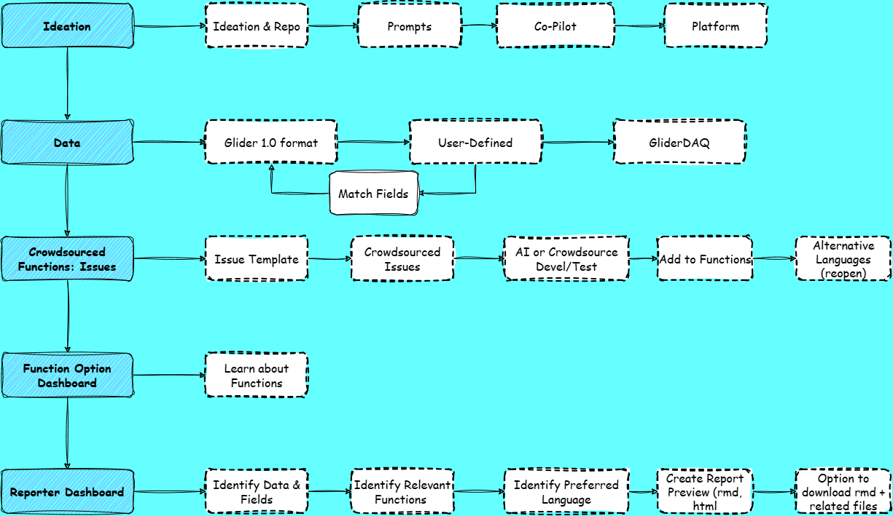

# Glider-Reporter: 

## A Flexible Template for Building Markdown Reports for UW Oceanographic Gliders

## Collaborators

**Shannon Rankin:** Southwest Fisheries Science Center [Project & Process Ideation]

**AI Agents:** Gemini [create prompts for copilot]; Github CoPilot [prompts–\> process]

Prelim Functions: [cite those created during rodeo]

**Crowdsourced:** (need to add in a minute)

## Folder Structure

## Background

## Goals

## Methods

1.  Process/System Ideation (Shannon, wee early hours of September 16!)
2.  Create Prompts (Shannon's works with Gemini to turn her mad braindump into a series of Prompts to turn into issues to work with Github CoPilot
3.  Create Repo (on Shannon's enterprise work account)
4.  Add first issue, assign to Github Copilot (in browser); keep an eye on token usage.
5.  Continue through prompts, modifying next steps as needed based on the output.

### Datasets

Optional: standardized datasets [Glider 1.0] or User Dataset

- If user dataset, they will match fields to standardized datasets (as needed)

### Workflow

**Github Repository:** glider-reporter (<https://github.com/shannonrankin/glider-reporter>)

## Lessons Learned

## Presentation

## References

## Acknowledgements

This project was part of a [Glider Rodeo Hackathon] which worked with (or was inspired by) PAM-Glider data collected by the NOAA Fisheries Glider Rodeo (2026). This weeklong event was hosted by NOAA Fisheries with support by Openscapes (JupyterHub, Support), Oregon State University (Zoom, Box data storage), Aquaview (technical support).
